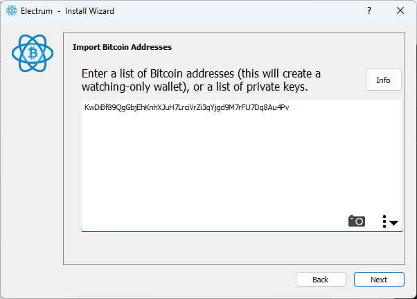
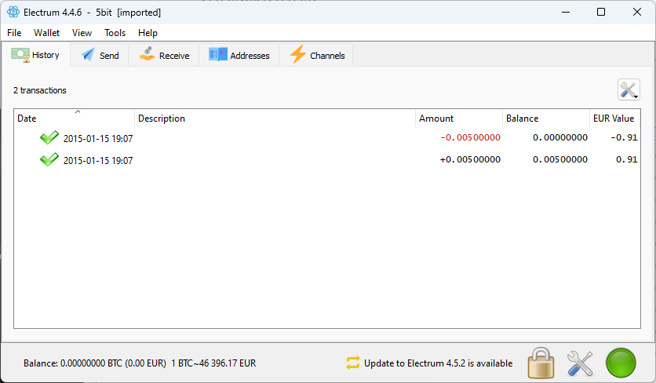
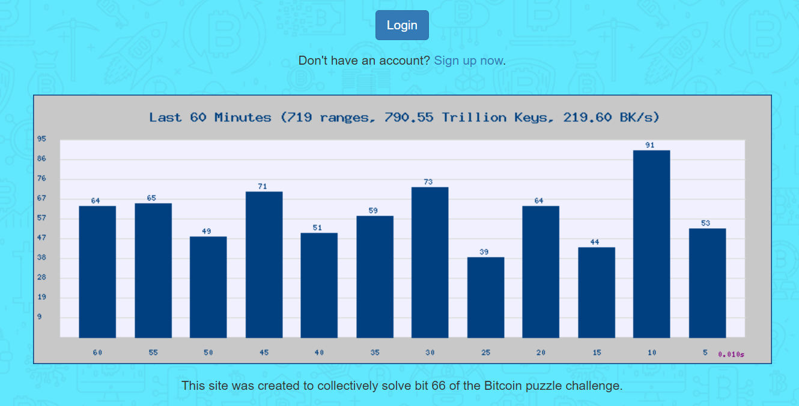

# 1000 BTC Challenge

A tool designed for educational purposes and brute-forcing n-bit long Bitcoin private keys, specifically crafted for the [Bitcoin puzzle transaction](https://blockchain.info/tx/08389f34c98c606322740c0be6a7125d9860bb8d5cb182c02f98461e5fa6cd15). This transaction initially contained 256 addresses, each progressively more challenging to decipher.


# Bitcoin Challenge

In the realm of Bitcoin, both public and private keys consist of 256 bits, represented as sequences of zeros and ones such as 010101001...00101. It's straightforward to derive a public key from a private key, but the reverse process is exceedingly difficult. Hence, you can freely share your public keys, but you must keep your private key confidential. If someone were to deduce the private key associated with a public key holding Bitcoins, they could transfer those Bitcoins to their own wallet.

This raises a question: Are 256 bits sufficient for security?

An anonymous individual initiated a challenge by creating 256 unique public keys, each holding some amount of Bitcoin. However, instead of using full 256-bit private keys for each address, he generated shorter versions, beginning with a length of just 1 bit. Thus, the first private key is only 1 bit long, the 69th key is 69 bits long, and so forth. The shorter the key, the easier it is to crack.

As of February 13, 2024, all keys up to 65 bits in length have been discovered using tools like Bitcrack. The challenge escalates with the number of bits; currently, many participants are attempting to crack the [66bit key](https://www.blockchain.com/explorer/addresses/btc/13zb1hQbWVsc2S7ZTZnP2G4undNNpdh5so), which contains 6.6 Bitcoins, although some are focusing on specific lengths, such as 125 bits.

But how is it done? How can one obtain the private key for a known address? This project aims to explore the fundamentals and perhaps develop a method that is remarkably efficient, even though existing programs are already highly optimized.

## History

* 15.01.2025: a transaction was created containing a transfer transaction for 256 different Bitcoin addresses.
* 11.07.2017: funds from addresses #161—256 were moved to the same number of addresses of the lower range – thus increasing the amount of funds on them.
* 31.05.2019: the creator of the "puzzles" creates outgoing transactions with the value of 1000 satoshi for addresses #65, #70, #75, #80, #85, #90, #95, #100, #105, #110, #115, #120, #125, #130, #135, #140, #145, #150, #155, #160 with the aim of probably comparing the difficulty of finding a private key for the address from which such a transaction was carried out, and one that there is no transaction.
* 16.04.2023: somebody (maybe the owner) increased the unsolved puzzles prizes again by x10. Now the puzzle #66 prize is 6.6 BTC, #67 is 6.7 BTC and so on... puzzle #160 prize is 16 BTC.


# How to solve this challenge?

The simplest concept for discovering a private key associated with a known Bitcoin address is to iterate through all possible private keys. Given that a private key is essentially a number, one could sequentially go through each number, generating its corresponding public key for values like k=1,2,3,4,5,6,7, and so forth. For each number, the private key in its 256-bit format will be calculated. Following this, the public key is derived and then transformed into a Bitcoin address. If this address matches the known address, you have successfully found the matching private key! To move the coins, you can import the private key in its Wallet Import Format (WIF) into your wallet, such as with [Electrum](https://electrum.org/), facilitating the transfer of the funds.


Example (5 Bits):

```
Bits: 5
Public Key (BTC Address): 1E6NuFjCi27W5zoXg8TRdcSRq84zJeBW3k
Congratulations - Private Key found 
Private Key (Decimal): 21
Private Key (WIF): KwDiBf89QgGbjEhKnhXJuH7LrciVrZi3qYjgd9M7rFU7Dq8Au4Pv
```




# Notice

If you're considering tackling this challenge independently, be aware that it could take years to complete on a single computer. Joining a pool, such as the 66 Bit Collective Bitcoin Private Key Cracking Pool, might be a more practical approach. By participating in a pool, you also don't need to grasp every detail of the challenge, as these pools typically offer ready-to-use executables. This collaborative effort can significantly increase the chances of success by combining the computational power of many individuals.

<br />
[66 Bit Collective Bitcoin Private Key Cracking Pool](http://ttdsales.com/66bit)


# Using this project

This project is meant to get the concept of the challenge and trying to increase the performance step by step. It incorporates a variety of techniques:

* It starts with a foundational Python-based approach (Approach 1), which, while easy to understand, is slow! This method is intended to help you to get the basics.
* The next technique (Approach 2) adds complexity by monitoring computation time and allowing for the continuation of calculations. It also prints out some useful information (WIF key and so on)
* (TODO) The third technique (Approach 3) leverages parallelization to enhance efficiency.
* (TODO) Future enhancements include developing a version in C to improve performance.
* (TODO) Additionally, a GPU-accelerated version is planned to further expedite the computation process.

# Quickstart

## Approach 1 - Understandable code

The first approach stands as the simplest among the methods employed. It serves as an excellent starting point and is configured by default to solve the 17-bit challenge, provided there are no modifications to the code in line 45. Read the code and try to understand its used libraries. I know it is tough, as there are several methods used, but it is worth to use the time understand the concept. A very good source is also this article [Generate BTC Private Key Explanation](https://groups.google.com/g/comp.lang.c/c/fbLnwQRBcPU?pli=1)

1. Install [Python 3](https://www.python.org/downloads/)
2. Then:

```
pip install base58
pip install ecdsa
python3 src/00_simple.py
```

### Output:

```
Searching 17 bit long private key for 1HduPEXZRdG26SUT5Yk83mLkPyjnZuJ7Bm (65536, 131072)
70000
80000
90000
Private Key (Decimal): 95823
```

## Approach 2 - Measure time and more

This method focuses on measuring the duration of operations and outputs the results in a format that can be readily utilized in your wallet. It requires you to specify the number of bits you wish to search for. Using this method, the performance achieved was 0.016 MKeys/sec, which is minimal when compared to BitCrack's capabilities. For instance, a 6800xt can achieve approximately 303 MKeys/sec, while a 6700xt can manage about 215 MKeys/sec with BitCrack.


```python3 src/01_measure.py 21``` 

### Example output (21bits):

```
python3 src/01_measure.py 21
Searching 1048576 21bit long private keys for 14oFNXucftsHiUMY8uctg6N487riuyXs4h (1048576, 2097152)
Total 0:00:48 | 763188 keys | 73 % | 0.016 MKeys/sec
--------------------------------
Congratulations - Private Key found
Private Key (Decimal): 1811764
Private Key (HEX): 1ba534
Private Key (WIF): KwDiBf89QgGbjEhKnhXJuH7LrciVrZi3qYjgd9M7rL6JJvw6XUry
Public Key (HEX): 031a746c78f72754e0be046186df8a20cdce5c79b2eda76013c647af08d306e49e
Public Key (BTC Address): 14oFNXucftsHiUMY8uctg6N487riuyXs4h
Bits: 21
--------------------------------
```

### Resume

In case you have to abort the computation, you can resume the process. The program will print the last checked private key, which you can then pass as the starting number the next time you start the computation, e.g.

```
python3 src/01_measure.py 21
Searching 1048576 21bit long private keys for 14oFNXucftsHiUMY8uctg6N487riuyXs4h (1048576, 2097152)
^C:00:03 | 38518 keys | 4 % | 0.018 MKeys/sec
--------------------------------
Aborted
To resume: 'python3 src/01_measure.py 21 1101338'
```

```
python3 src/01_measure.py 21 1101338
Searching 1048576 21bit long private keys for 14oFNXucftsHiUMY8uctg6N487riuyXs4h (1101338, 2097152)
```

## (TODO) Approach 3 - Parallelization

This approach leverages parallel computing techniques to significantly enhance the speed of the key search process. By distributing the workload across multiple processors or threads, it aims to improve efficiency and reduce the time required to find a matching key.

## (TODO) Approach 4 - C Code simple

This method involves implementing the algorithm in C, a low-level programming language known for its speed and efficiency. The simplicity of the code focuses on straightforward implementation without parallelization, offering improved performance over Python-based methods due to the compiled nature of C.

## (TODO) Approach 5 - C Code Parallelization

Building on the fourth approach, this method adds parallelization to the C implementation. It utilizes multi-threading or other parallel computing techniques within C to further accelerate the search process by taking advantage of multiple CPU cores.

## (TODO) Approach 6 - Cuda

This approach employs CUDA (Compute Unified Device Architecture), a parallel computing platform and programming model developed by NVIDIA for general computing on graphical processing units (GPUs). By harnessing the power of GPU acceleration, this method can achieve orders of magnitude higher performance than CPU-based approaches, making it significantly faster at processing massive amounts of data, such as brute-forcing cryptographic keys.

# Links

* [Bitcoin puzzle transaction](https://blockchain.info/tx/08389f34c98c606322740c0be6a7125d9860bb8d5cb182c02f98461e5fa6cd15) The original transaction
* [Generate BTC Private Key Explanation](https://groups.google.com/g/comp.lang.c/c/fbLnwQRBcPU?pli=1) A good starting point
* [Bitcrack](https://github.com/brichard19/BitCrack) A cuda and cl based approach
* [Original Forum Post](https://bitcointalk.org/index.php?topic=1306983.0)
* [TPs Go Bitcoin Tests - Addresses](http://gobittest.appspot.com/Address) Convert private to public key online
* [BitAddress.org](https://www.bitaddress.org) Generate a private key by mouse movements
* [66 Bit Collective Bitcoin Private Key Cracking Pool](http://ttdsales.com/66bit)

# Author

Alexander Thurn

